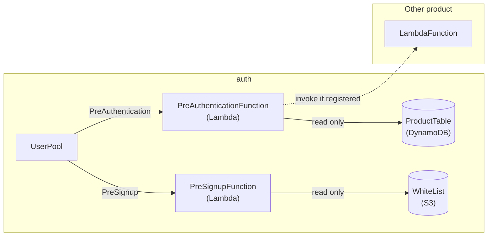

# auth

UserPool

# Development

## Structure

## Table: Product

|AttrName|Type|Schema|Description        |
|--------|----|------|-------------------|
|ClientId|S   |PK    |                   |
|AppCode |S   |      |                   |
|Created |N   |      |                   |
|FuncArn |S   |      |ClientTriggerLambda|
