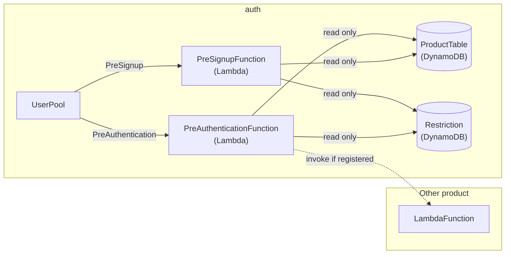

# auth

UserPool

# Development

## Structure

## Table: Product

|AttrName |Type|Schema|Description        |
|---------|----|------|-------------------|
|ClientId |S   |PK    |                   |
|AppCode  |S   |      |                   |
|FuncArn  |S   |      |ClientTriggerLambda|
|Timestamp|N   |      |(Micro second)     |

## Table: Restriction

|AttrName |Type|Schema|Description        |
|---------|----|------|-------------------|
|Email    |S   |PK    |                   |
|AppCodes |SS  |      |                   |
|Timestamp|N   |      |(Micro second)     |
